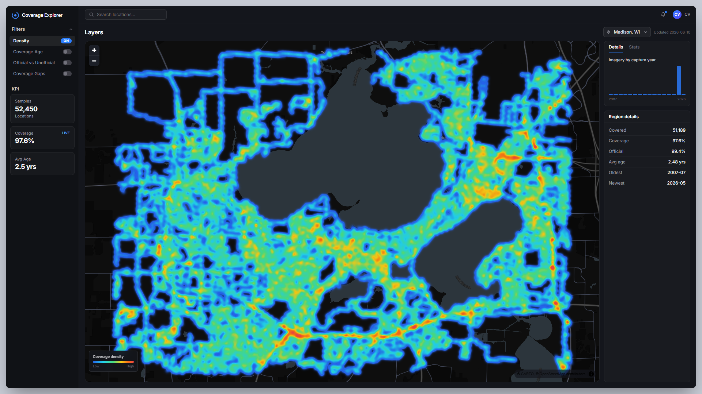
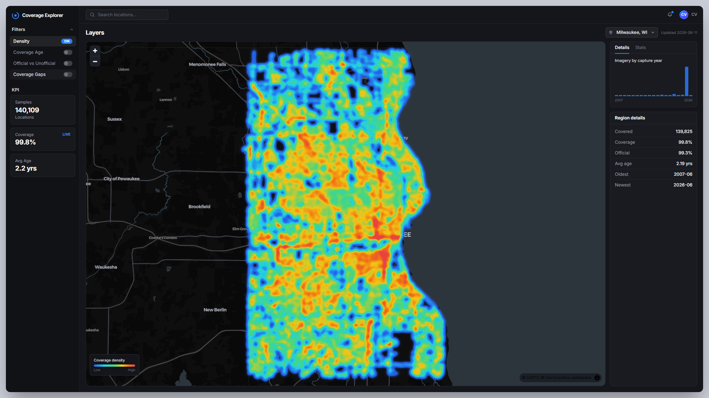
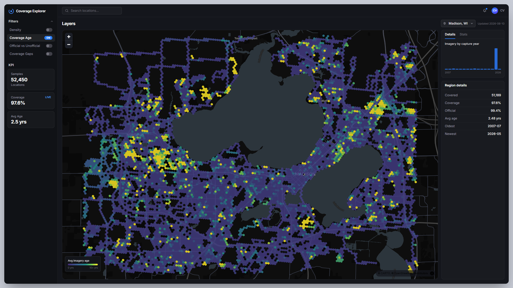
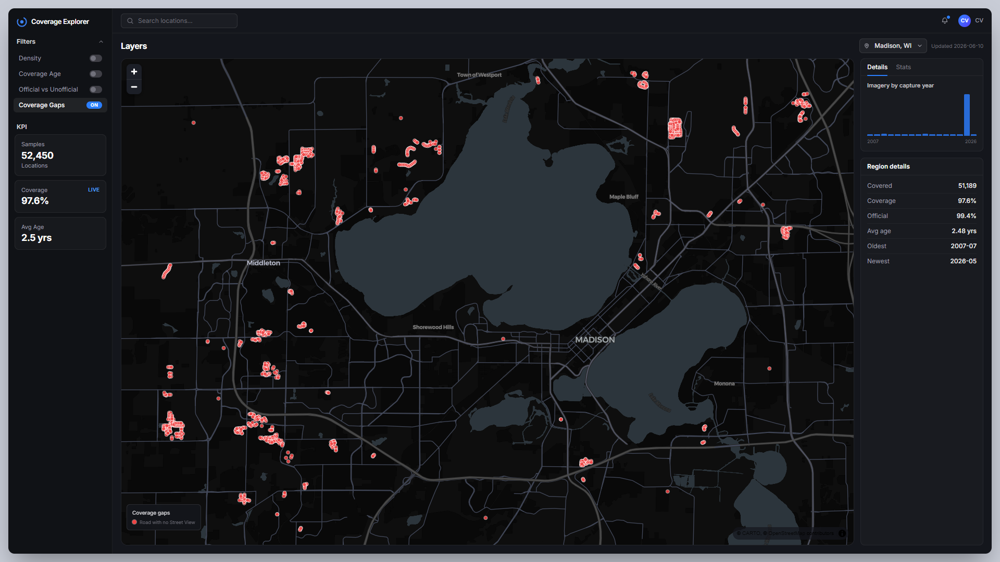
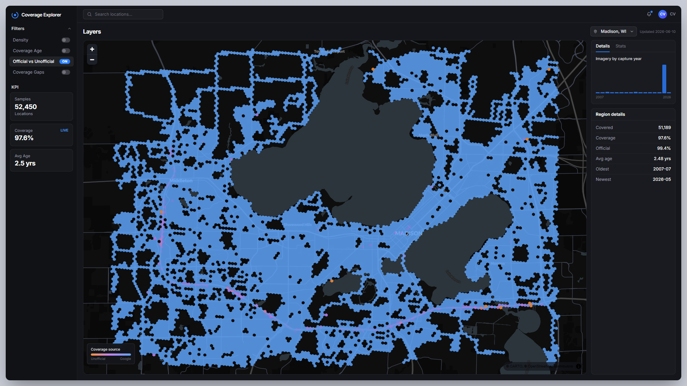

# Street View Coverage Explorer

**An interactive dashboard for the Google Street View *coverage meta* — built on 192,559 real
measurements of every drivable road in Madison and Milwaukee, WI.**



Not the imagery — the *metadata*. Where Street View exists, how stale it is, whether it came
from a Google car or someone's photosphere, and which roads have no coverage at all: the
questions GeoGuessr map-makers and geodata nerds actually ask.

> Live demo: *deployment in progress — see [docs/DEPLOYMENT_PLAN.md](docs/DEPLOYMENT_PLAN.md)*

## The real numbers (Madison, WI)

Every drivable road sampled every 50 meters with `osmnx`, each point checked against Google's
Street View metadata endpoint:

| | |
| --- | --- |
| Road sample points | **52,450** |
| With Street View coverage | **51,189 (97.6%)** |
| Official (Google car/trekker) | **99.4%** |
| Average imagery age | **2.5 years** |
| Oldest panorama still served | **July 2007** |
| Roads with no coverage | **1,261 points**, clustered in new-build subdivisions |

The 2025 city-wide recapture dominates (41,798 of 51,189 covered points), but pockets of
2007–2011 imagery survive — and the coverage gaps map almost perfectly onto subdivisions
built after Google's last drive.

A second region — **Milwaukee: 140,109 points, 99.8% covered, avg age 2.2 years** — runs
through the identical pipeline; switch regions in the app and the map flies between them.



## The four layers

| Coverage age | Coverage gaps |
| --- | --- |
|  |  |
| *Yellow = imagery Google hasn't refreshed since ~2007–2011* | *Red = drivable road, no Street View within 50 m* |

| Density | Official vs unofficial |
| --- | --- |
|  |  |
| *Smooth heat surface traced by the actual road network* | *Blue = Google; orange/pink = user photospheres* |

## How the data is made

1. **Sample** — `osmnx` pulls the OpenStreetMap drivable network for the region bbox; points
   are interpolated every 50 m along every edge in UTM, then deduped on a ~10 m grid
   (`data/fetch_coverage.py`).
2. **Measure** — each point queries the Street View **metadata** endpoint (free; no imagery is
   scraped). Responses are cached to JSONL as they arrive, so runs are resumable and re-runs
   are free. Rate-limited, exponential backoff, and the API key is scrubbed from any error
   output.
3. **Classify** — `copyright` field → official Google vs user photosphere; `ZERO_RESULTS`
   within a 50 m radius → coverage gap.
4. **Load** — `data/load_postgis.py` writes samples to PostGIS, precomputes H3 hexbin
   aggregates at resolutions 7–10, and names each gap point by its nearest road
   (spatial join against the OSM edges).

## Architecture

```
React + Vite + TS ── MapLibre GL (dark basemap)
  Tailwind            deck.gl (Heatmap/Polygon/Scatterplot layers)
  Framer Motion       │
                      ▼  GeoJSON over HTTP
FastAPI ── pydantic models mirroring the TS types
                      │
                      ▼
PostgreSQL + PostGIS ── precomputed hexbins, samples, regions
                      ▲
                      │  local pipeline (osmnx + metadata fetch)
                      └── the Google key never leaves the dev machine
```

The repo is **contract-first**: [`docs/API_CONTRACT.md`](docs/API_CONTRACT.md) is the single
source of truth for every shape that crosses the wire. The frontend was built against mock
data matching the contract, the backend was built to serve the identical shapes
(pytest shape tests enforce it), and the swap from mocks to live API was a one-line flip.

## Run it locally

```sh
# Database (Docker)
docker run -d --name svce-postgis -e POSTGRES_USER=... -e POSTGRES_PASSWORD=... \
  -e POSTGRES_DB=streetview -p 5432:5432 postgis/postgis:16-3.4

# Pipeline (needs GOOGLE_MAPS_API_KEY in backend/.env — never committed)
cd data && python -m venv .venv && .venv/Scripts/pip install -r requirements.txt
.venv/Scripts/python fetch_coverage.py --region madison --test   # small verification batch
.venv/Scripts/python fetch_coverage.py --region madison          # full run (resumable)
.venv/Scripts/python load_postgis.py --region madison --file output/coverage.madison.geojson

# Backend  (DATABASE_URL in backend/.env)
cd backend && python -m venv .venv && .venv/Scripts/pip install -r requirements.txt
.venv/Scripts/python -m uvicorn app.main:app --reload            # :8000
.venv/Scripts/python -m pytest                                   # contract shape tests

# Frontend
cd frontend && npm install && npm run dev                        # :5173
```

## Repo layout

```
/frontend   Vite + React + TS + Tailwind + Framer Motion + MapLibre GL + deck.gl
/backend    FastAPI serving the contract from PostGIS
/data       osmnx sampling → metadata fetch → PostGIS load
/docs       API contract, design brief, deployment plan, screenshots
```
